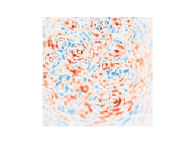
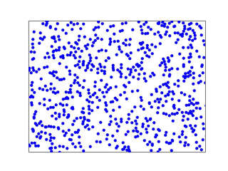
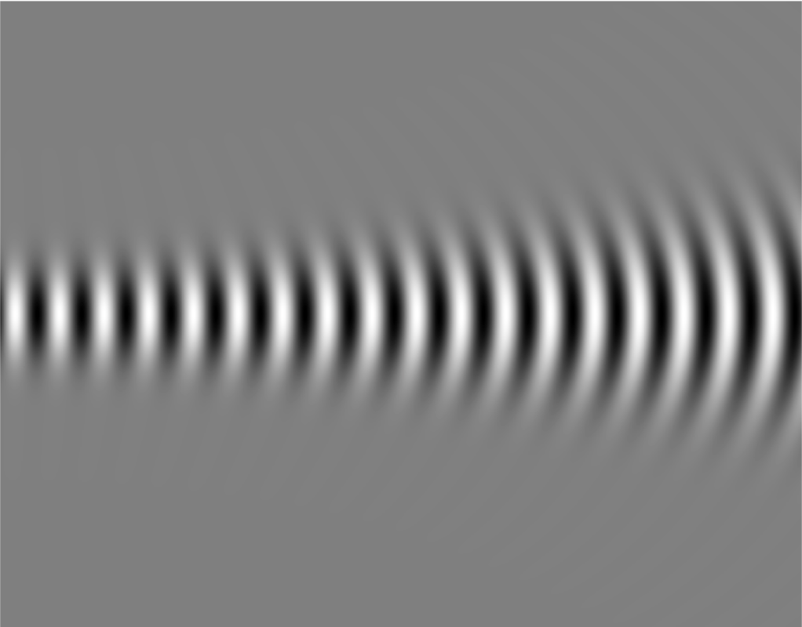

# Numerical Physics Projects

This repository collects small Python projects and a final course project demonstrating physics concepts through simulation and visualization.

---
## Projects

### 1) [Wave Superposition](Wave_Superposition)
- Visualizes constructive/destructive interference from pairs of sinusoids.
- Emphasizes how frequency, phase, and amplitude shape the resulting waveform.
- Includes example plots/animations for fast visual inspection of effects.

### 2) [2D Particle Gas](2D_particle_gas)
- Simulates a 2D idealized gas with elastic particle–particle and particle–wall collisions.
- Tracks trajectories, speeds, and aggregate statistics; illustrates approach to equilibrium.
- Useful for discussing conservation laws and links to Maxwell–Boltzmann intuition.

### 3) [Numerical Optics](Numerical_Optics) — Undergraduate Final Project (Physics 325)
- **Report:** [`Numerical_Optics.pdf`](Numerical_Optics/Numerical_Optics.pdf)  
- Implements multiple solvers for the paraxial wave/propagation equation:
  - Rayleigh–Sommerfeld integral, Leapfrog FD, Forward Euler, and Crank–Nicolson.
- Compares stability, boundary conditions, and computational trade-offs; includes derivations and results.

### 4) [Anharmonic Oscillator](Anharmonic_Oscillator) — Undergraduate Final Project (Physics 311)
- **Notebook:** [`Anharmonic_Oscillator.ipynb`](Anharmonic_Oscillator/Anharmonic_Oscillator.ipynb)  
- Derives equations of motion (Lagrangian → Hamiltonian → nonlinear ODE) and analyzes:
  - Amplitude-dependent period (elliptic integral), parametric driving, inverted-pendulum stabilization,
  - Onset of chaos and sensitivity to initial conditions (with RK4 simulations and phase portraits).

### 5) [Laplace Equation via Relaxation](Laplace_Relaxation) — Undergraduate Honors Project (Physics 322)
- **Report:** [`Laplace_Relaxation.pdf`](Laplace_Relaxation/Laplace_Relaxation.pdf)  
- Implements a 2D relaxation solver on a rectangular grid and benchmarks against an analytic Fourier-series solution.
- Includes convergence checks, error metrics (RMSE/percent accuracy), and side-by-side visual comparisons.

The scripts require Python 3.x and the following external libraries:

- [NumPy](https://numpy.org/)  
- [Matplotlib](https://matplotlib.org/)  
- [SciPy](https://scipy.org/)  

You can install them with:

```bash
pip install numpy matplotlib scipy
```

---

## Usage
Clone the repo and run any script:

```bash
git clone https://github.com/hschn58/Physics.git
cd Physics/Wave_Superposition
python3 wave_superposition.py
```

---

## Example Outputs

| Wave Superposition | Particle Dynamics | Rayleigh–Sommerfeld Integral |
|--------------------|-------------------|-------------------------------|
|  |  |  |

---

## License 

This project is licensed under the [MIT License](./LICENSE).
