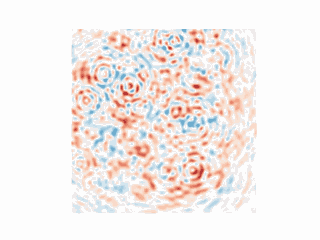
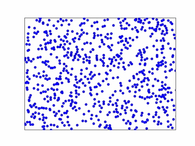
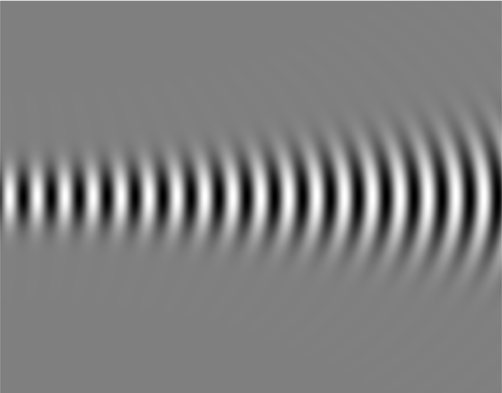

# Numerical Physics Projects

This repository collects small Python projects and a final course project demonstrating physics concepts through simulation and visualization.

---
## Projects

### 1) [Wave Superposition](Wave_Superposition)
- Simulates 2D interference patterns from a variable number of oscillating point sources with 1/r energy-conserving decay.
- Each source has random position, wavevector, frequency, amplitude, and phase.
- Produces animated visualizations of the resulting dynamic interference field.

### 2) [2D Particle Gas](2D_particle_gas)
- Simulates a 2D idealized gas with elastic particle–particle and particle–wall collisions.
- Tracks trajectories, speeds, and aggregate statistics; illustrates approach to equilibrium.
- Useful for discussing conservation laws and links to Maxwell–Boltzmann intuition.

### 3) [Numerical Optics](Numerical_Optics) — Undergraduate Final Project (Physics 325)
- **Report:** [`Numerical_Optics.pdf`](Numerical_Optics/Numerical_Optics.pdf)  
- Implements multiple solvers for the paraxial wave/propagation equation:
  - Rayleigh–Sommerfeld integral, Leapfrog FD, Forward Euler, and Crank–Nicolson.
- Compares stability, boundary conditions, and computational trade-offs; includes derivations and results.

### 4) [Anharmonic Oscillator](Anharmonic_Oscillator) — Undergraduate Final Project (Physics 311)
- **Notebook:** [`Anharmonic_Oscillator.ipynb`](Anharmonic_Oscillator/Anharmonic_Oscillator.ipynb)  
- Derives equations of motion (Lagrangian → Hamiltonian → nonlinear ODE) and analyzes:
  - Amplitude-dependent period (elliptic integral), parametric driving, inverted-pendulum stabilization,
  - Onset of chaos and sensitivity to initial conditions (with RK4 simulations and phase portraits).

### 5) [Laplace Equation via Relaxation](Laplace_Relaxation) — Undergraduate Honors Project (Physics 322)
- **Report:** [`Laplace_Relaxation.pdf`](Laplace_Relaxation/Laplace_Relaxation.pdf)  
- Implements a 2D relaxation solver on a rectangular grid and benchmarks against an analytic Fourier-series solution.
- Includes convergence checks, error metrics (RMSE/percent accuracy), and side-by-side visual comparisons.

## Quickstart

```bash
git clone https://github.com/hschn58/Physics.git
cd Physics
pip install -r requirements.txt
```

Then run any subproject:

```bash
cd Wave_Superposition
python3 E_Conserved.py
```

---

## Example Outputs

| Wave Superposition | Particle Dynamics | Rayleigh–Sommerfeld Integral |
|--------------------|-------------------|-------------------------------|
|  |  |  |

---

## License 

MIT License
